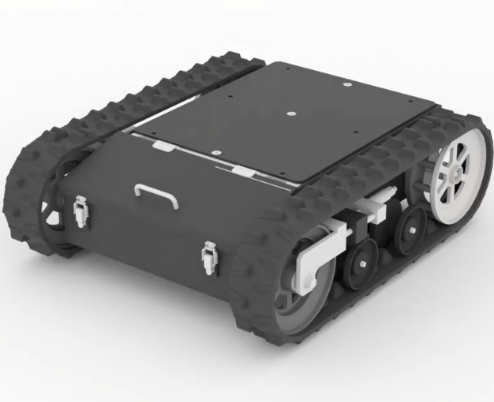
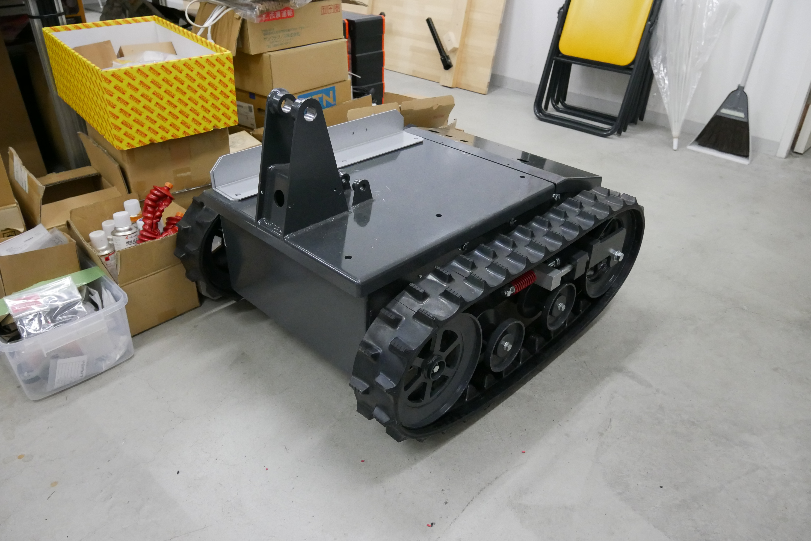

# msd_ros2
development for msd version ROS2

やること
- 自動運転
  - LiDAR
  - 障害物回避 
- 画像認識
- トンネル内自動走行
## Dependency
- Ubuntu 20.04.6 LTS
- ROS2 Foxy Fitzroy

## Devices
- Jetson Nano B01 

LiDAR
- rplidar a1
- rplidar s1
- HOKUYO URM-40LC-EW

## Directories
### msd_ros2_mk1 : オリエンタルモータ
<br/>
<div align="center">

</div>
<br/>

### msd_ros2_mk2 : 椿本モータ
<br/>
<div align="center">

</div>
<br/>

## Install
ROS2 ワークスペースのためのディレクトリを作成．`ros2_ws`がすでにある場合はこの手順は不要．
```bash
mkdir -p ros2_ws/src && cd ros2_ws/src
```

リポジトリのダウンロード
```bash
git clone https://github.com/tomoswifty/msd_ros2.git
```

ROS2のインストール．ROS2をインストールしてあれば不要．
```bash
cd ~/ros2_ws/src/msd_ros2/msd_ros2_installer/
./ros2_foxy-desktop_installer.sh
```

依存パッケージのインストール
```bash

```

センサーのパッケージのインストール
```bash

```

## Usage